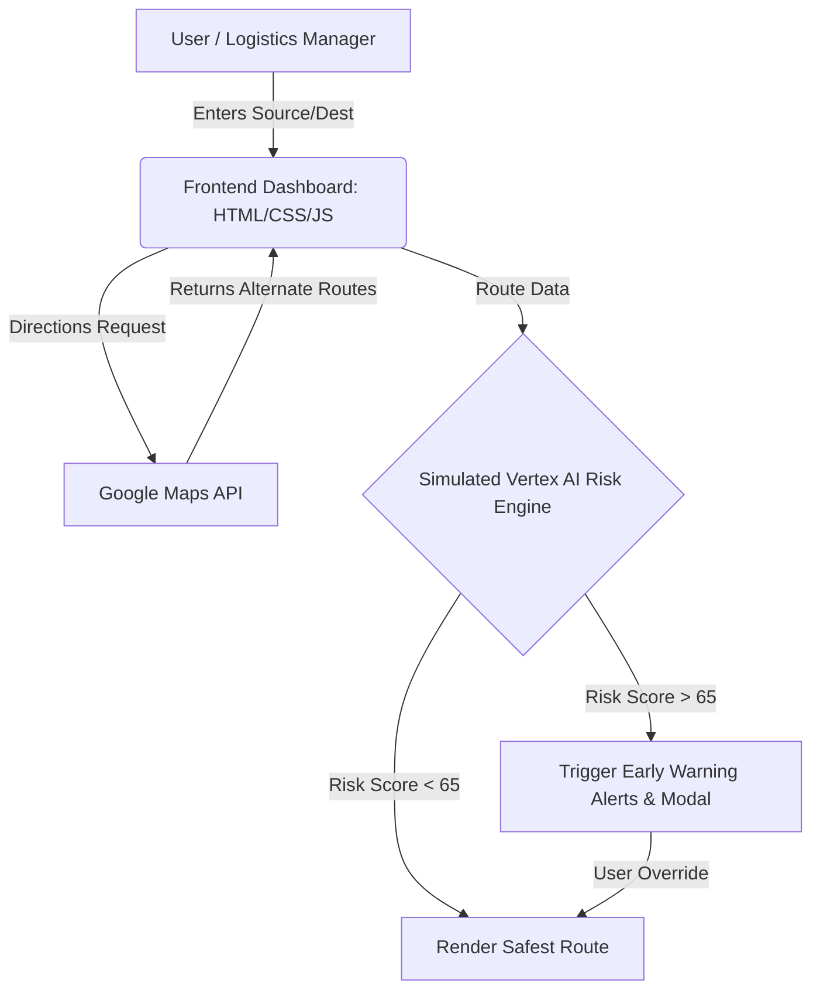

# RouteGuard AI 🛡️

**Climate-Resilient Smart Logistics Dashboard**

RouteGuard AI is a hackathon prototype that predicts supply chain disruptions, supports smart priority routing, and provides early warning alerts for businesses to reroute their shipments proactively before disasters strike.

## 🚀 Features
- **Smart Priority Routing**: Choose between "Normal" (safest route avoiding climate/traffic risks) and "Emergency" (fastest route bypassing safety protocols).
- **Early Warning System**: Simulated AI Risk Engine that assigns a 0-100 risk score to routes.
- **Automated Alerts**: Triggers severe weather (e.g., floods) or traffic disruption alerts if the safest route exceeds risk thresholds.
- **Startup-Grade UI**: A beautiful, glassmorphic dark-mode dashboard built for an impressive demo.

## 🏗 Architecture Diagram

## 🛠 Tech Stack
- Frontend: HTML5, CSS3, Vanilla JavaScript
- Mapping & Routing: Google Maps JavaScript API, Places API, Directions API
- Deployment: GitHub Pages

## 💻 Local Setup
1. Clone this repository.
2. Open `index.html` in your code editor.
3. Replace `YOUR_API_KEY_HERE` at the bottom of the file with your Google Maps API Key.
4. Open `index.html` in any modern web browser.
